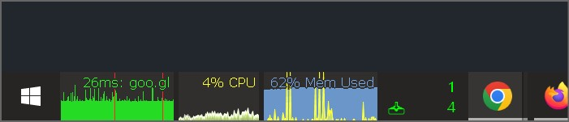

# rainmeter

inspired by perfgraph - https://www.majorgeeks.com/files/details/perfgraph.html

## Rainmeter Approach:

## Skins:
- Clock/Simple.ini
- Ping/Graph.ini
- CPU/Graph.ini
- RAM/Graph.ini
- Network/Taskbar.ini

## Additional
- if you want the temperature to show in the CPU graph, install this https://www.alcpu.com/CoreTemp/
